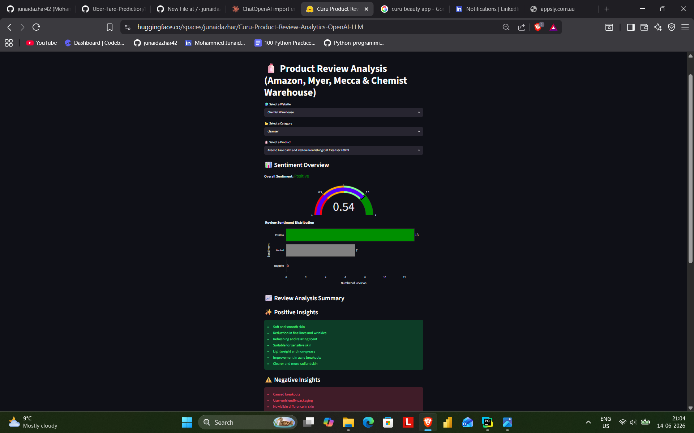
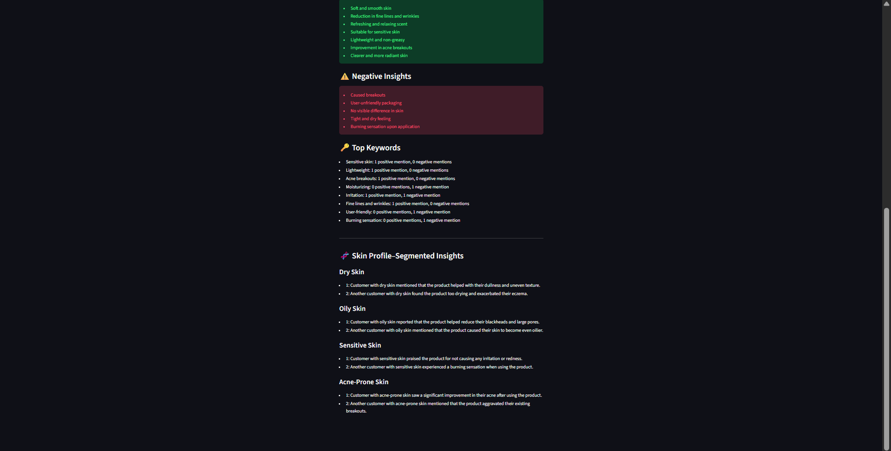
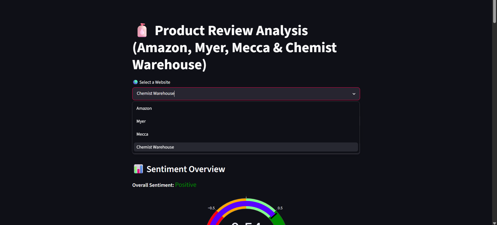
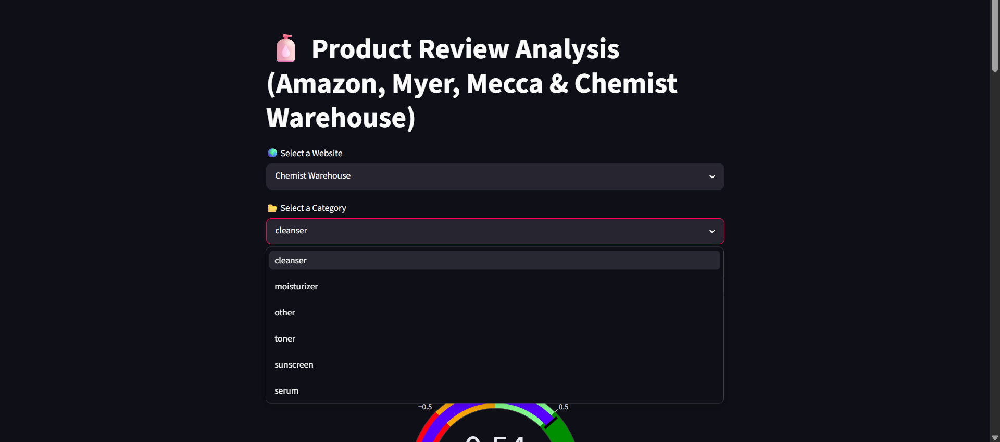
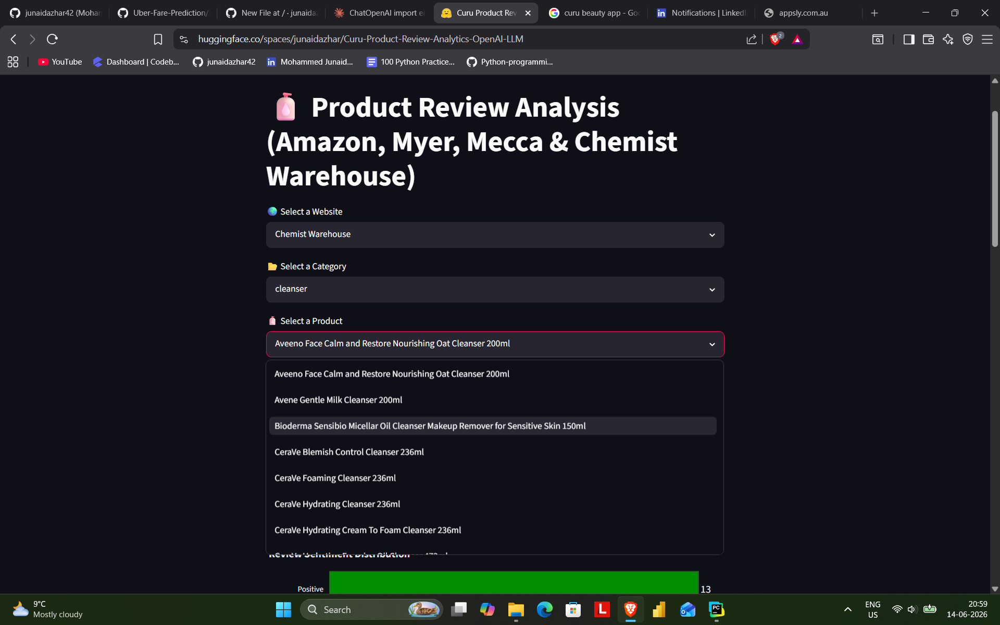
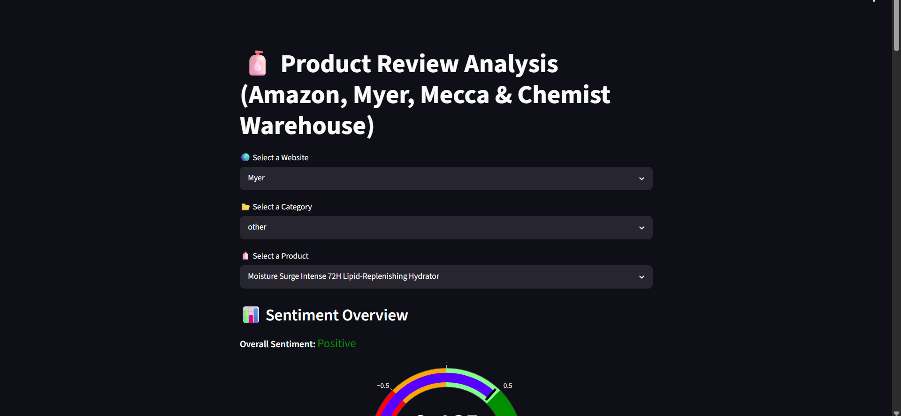
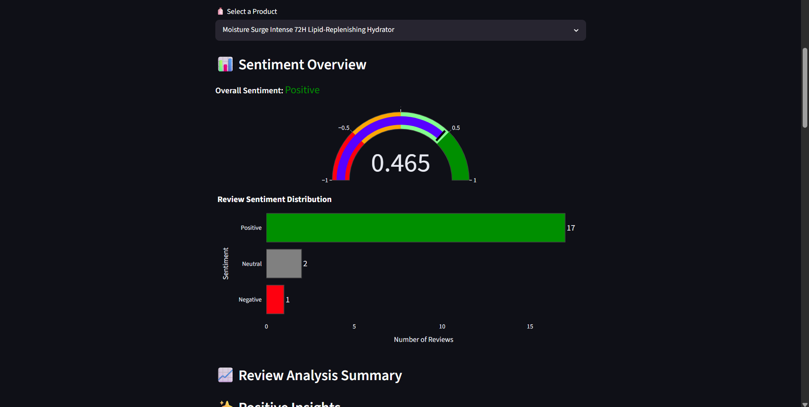
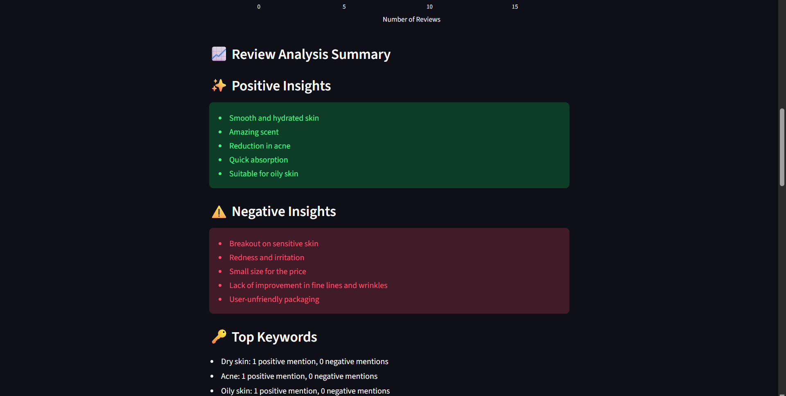
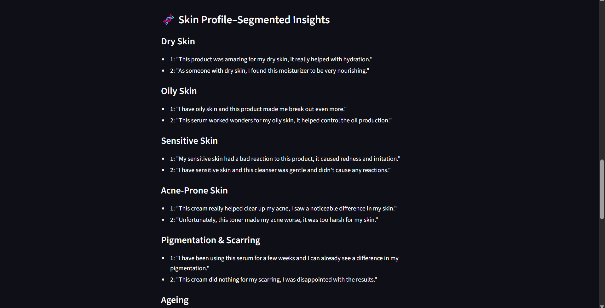
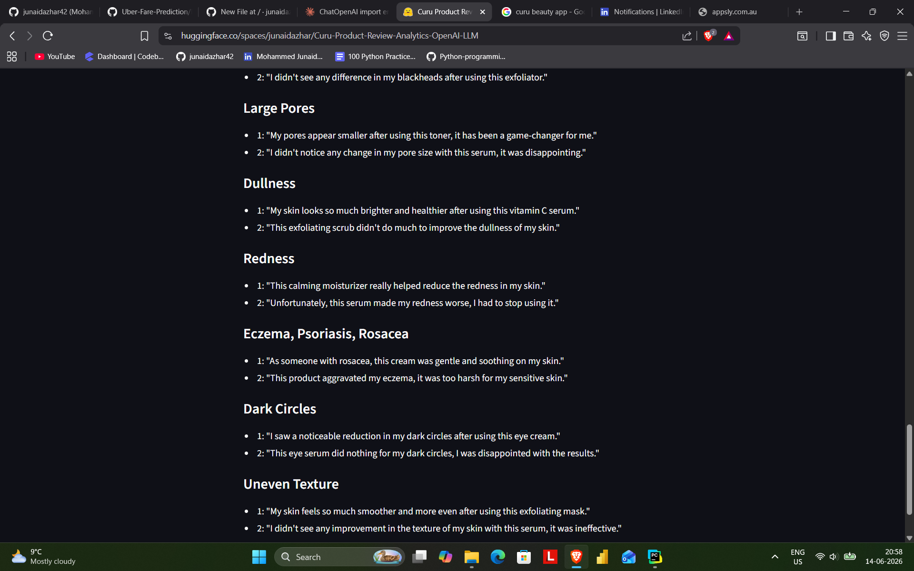

# 🧴 Curu Product Review Analytics Dashboard 
 
An NLP-powered dashboard that analyses thousands of skincare product reviews across four major Australian retailers (Amazon, Myer, Mecca and Chemist Warehouse), 
combining VADER sentiment analysis with GPT-3.5-turbo to surface actionable insights segmented by skin type, sensitivity, and skin concerns.

 **[▶ Try the live demo](https://huggingface.co/spaces/junaidazhar/Curu-Product-Review-Analytics-OpenAI-LLM)**

 ---
 
## 📸 Screenshots

| Output (i) | 
|---|
|  | 

| Output (ii) |
|---|
|  |


| Websites | 
|---|
|  | 

| Categories |
|---|
|  | 

| Product List |
|---|
| 

---

 ## Project Overview
 
This project was developed as part of a **Work Integrated Learning (WIL) placement at [Curu Pvt Ltd Australia](https://www.linkedin.com/company/curuclub/posts/?feedView=all)** 
during the final semester of Master of Data Science at RMIT University (Melbourne, Victoria, Australia). The goal was to build an end-to-end product intelligence tool
for the skincare industry — aggregating customer reviews from Amazon, Myer, Mecca, and Chemist Warehouse, and transforming raw text into structured insights for 
product teams and analysts.
 
The dashboard operates in two layers:
 
- **Sentiment Layer** — VADER pre-processes all reviews offline, labelling each as Positive, Negative, or Neutral and computing a compound score per product.
- **LLM Layer** — On demand, GPT-3.5-turbo runs two analysis chains: a general insights chain (key positives, negatives, top keywords) and a skin profile segmentation chain (feedback grouped by skin type, sensitivity, and concern).

---

 ## 🛠 Tech Stack & Model Details
 
| Component | Technology |
|---|---|
| Frontend | Streamlit |
| Sentiment Analysis | VADER (vaderSentiment) |
| LLM | OpenAI GPT-3.5-turbo |
| LLM Orchestration | LangChain (LCEL pipe syntax) |
| Visualisation | Plotly (gauge chart, bar chart) |
| Data Handling | Pandas, JSON |
| Environment Management | python-dotenv |
| Deployment | Hugging Face Spaces (Docker + Streamlit) |
 
**LangChain Architecture:**
- `PromptTemplate` + `ChatOpenAI` chained via LCEL (`prompt | llm`)
- Two separate chains run per product selection:
  - `chain_general` — extracts top 5 positives, top 5 negatives, and up to 8 keywords with mention counts
  - `chain_skin` — segments feedback by skin type (Dry, Oily, Combination, Normal), sensitivity (Sensitive / Not Sensitive), and 10 skin concerns (Acne, 
  Pigmentation & Scarring, Ageing, Blackheads, Large pores, Dullness, Redness, Eczema / Psoriasis / Rosacea, Dark circles, Uneven texture  )

--

## ⚙️ Steps to Run Locally
 
**1. Clone the repository**
```bash
git clone https://github.com/YOUR_USERNAME/YOUR_REPO_NAME.git
cd YOUR_REPO_NAME
```
 
**2. Create and activate a virtual environment**
```bash
python -m venv venv
 
# Windows
venv\Scripts\activate
 
# macOS / Linux
source venv/bin/activate
```
 
**3. Install dependencies**
```bash
pip install -r requirements.txt
```
 
**4. Set up your OpenAI API key**
 
Create a `.env` file in the project root:
```
OPENAI_API_KEY=sk-your-key-here
```
 
**5. Run the dashboard**
```bash
streamlit run curu_dashboard.py
```
 
The app will open at `http://localhost:8501`
 
---
 
## 📦 Requirements
 
```
streamlit>=1.32.0
pandas>=2.0.0
plotly>=5.18.0
langchain-openai>=0.1.0
langchain-core>=0.1.0
python-dotenv>=1.0.0
```
 
Install via:
```bash
pip install -r requirements.txt
```
 
---
 
## Project Directory Structure
 
---
 
## How It Works
 
### 1. Data Loading
Reviews and product-level sentiment summaries are loaded from paired JSON + CSV files for each of the four retailers. The app uses `@st.cache_data` to avoid 
reloading on every interaction.
 
### 2. Product Selection
Users have the options to choose website, category of the products and the product names through cascading dropdowns:
- **Website** → Amazon, Myer, Mecca, or Chemist Warehouse
- **Category** → Automatically assigned from product name keywords (cleanser, toner, serum, moisturizer, sunscreen)
- **Product** → All products within the selected category
### 3. Sentiment Overview
For the selected product, the dashboard displays:
- **Overall Sentiment label** (Positive / Negative / Neutral) colour-coded green, red, or grey
- **Compound Score Gauge** — an interactive Plotly gauge ranging from -1 (most negative) to +1 (most positive)
- **Sentiment Distribution Bar Chart** — horizontal bar showing counts of Positive, Neutral, and Negative reviews
### 4. LLM General Insights
Up to 50 positive and 50 negative reviews are passed to GPT-3.5-turbo via LangChain. The model returns:
- ✨ **Top 5 Positive Insights** — what customers consistently appreciated
- ⚠️ **Top 5 Negative Insights** — repeated complaints and concerns
- 🔑 **Top 8 Keywords** — ingredients, effects, or themes with positive and negative mentions
### 5. Skin Profile Segmentation
A second LLM chain analyses the same reviews through a skincare-specialist lens, grouping feedback by:
 
**Skin Type:** Dry · Oily · Combination · Normal
 
**Sensitivity:** Sensitive · Not Sensitive
 
**Skin Concerns:** Acne · Pigmentation & Scarring · Ageing · Blackheads · Large Pores · Dullness · Redness · Eczema / Psoriasis / Rosacea · Dark Circles · Uneven Texture
 
This segmentation helps identify which customer profiles the product works best for and which it doesn't.
 
---
 
## Additional Screenshots
| Landing Page | 
|---|
|  | 

| Sentiment Overview |
|---|
 |

| Insights & Keywords | 
|---|
|  | 

| Skin Types |
|---|


| Skin Concerns |
|---|

